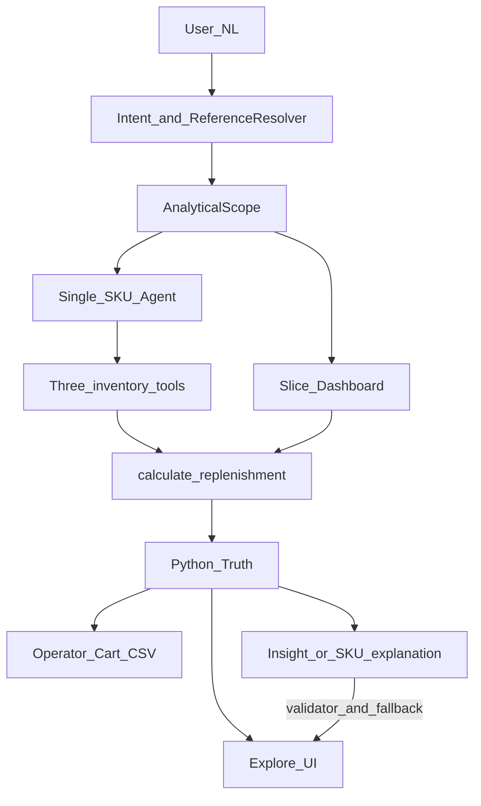
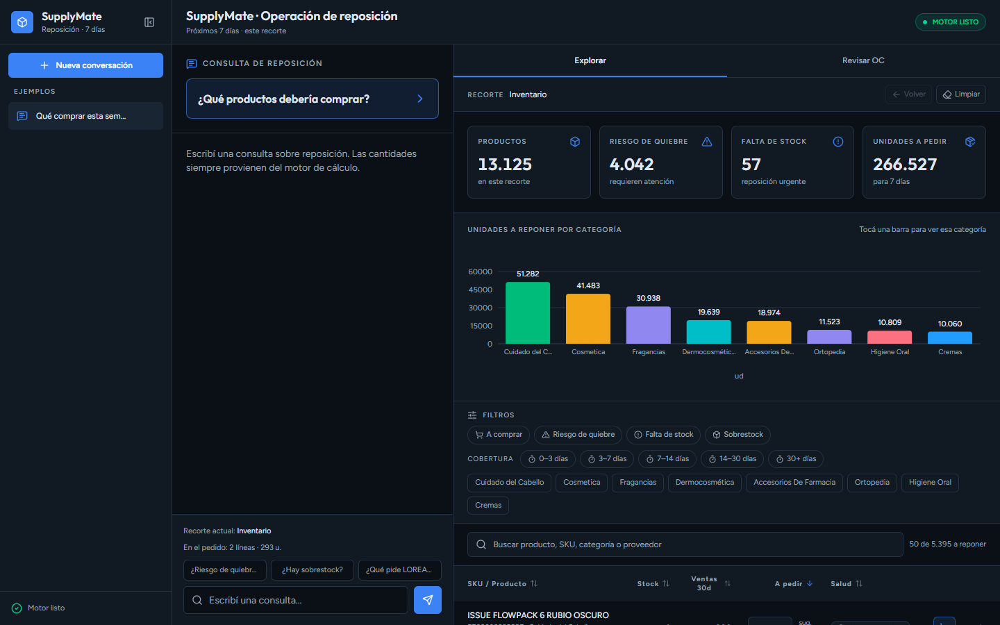
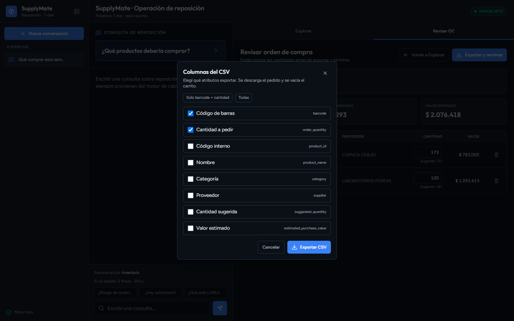

# SupplyMate

*Español* · [English](README.md)

MVP de AI Engineering: reposición conversacional sobre un catálogo estructurado — lenguaje natural como interfaz, Python como fuente de verdad.

**Principio:** *LLM orchestrates, deterministic code decides.*

*Términos técnicos en inglés a propósito (como en el código): slice, SKU, ROP, tools, qty, insight, commit.*

## Por qué existe

Un operador de distribución necesita una respuesta confiable a:

> ¿Cuánto debería pedir del producto X para cubrir los próximos 7 días?

El failure mode difícil no es “no hay respuesta” — es la **inconsistencia** entre interpretación, stock, demanda, filtros y cantidad recomendada. SupplyMate separa esos concerns:

- el **LLM orquesta** (intención, explicación, insight)
- el **código Python decide** (fórmula, filtros, CSV)

## Para quién es

- **Applied AI engineers** que estudian tool-calling + lógica determinística + insights validados
- **Ops / supply** que necesitan una OC exportable sobre el mismo recorte que ven
- **Engineers evaluating LLM + deterministic workflows** (no chat wrappers que inventan números)
- **Entrevistas** — MVP chico, testeable, fácil de narrar

## ¿Por qué no usar X?

- **RAG / embeddings** — CSV estructurado y matching lexical de SKU; sin embeddings en runtime
- **Que el LLM calcule** — los números críticos los posee Python; el modelo narra hechos validados
- **Forecasting / ML / EOQ** — fuera de scope; la política de reposición es explícita y simple
- **Multi-agent swarm** — roles LLM acotados (intent / explain / insight / commit), no un enjambre

Filtros y KPIs quedan en Python sobre el scope activo para que el modelo no sea dueño del panel. Alternativas extendidas (LangChain, Postgres/dbt, etc.): [`docs/operations/local-dev.es.md`](docs/operations/local-dev.es.md). Arquitectura: [`docs/contract/architecture.es.md`](docs/contract/architecture.es.md).

## Cómo funciona

El lenguaje natural entra por intent y resolución de referencias, se convierte en un `AnalyticalScope`, y luego en el slice de Explorar o en un agente de un solo SKU. La cantidad recomendada siempre sale de `calculate_replenishment()` en Python.



*Vista simplificada. La explicación de SKU y el insight/commit son roles LLM distintos con guardrails.*

| Artefacto | Rol |
|-----------|-----|
| Catálogo CSV (`data/`) | Catálogo demo reproducible (~13k SKUs) |
| `CatalogStore` | Carga in-memory y resolución de productos |
| `AnalyticalScope` | Estado analítico estructurado (filtros, horizonte) |
| `calculate_replenishment()` | Verdad operativa de qty |
| Roles LLM | Intent, explain, insight; narración commit opcional |
| Validator + fallback | Rechaza insight inválido; resumen determinístico si falla |
| UI Vite | Chat + **Explorar** / **Revisar OC** (consume la verdad del slice) |

### Conceptos centrales

- **AnalyticalScope** — estado analítico estructurado compartido por chat, panel y predicados de export
- **Deterministic replenishment** — qty order-up-to en Python (`ceil`, `max(0, …)`); fórmula en [`local-dev`](docs/operations/local-dev.es.md)
- **LLM boundary** — el modelo interpreta, explica y resume; no controla qty, filtros ni filas CSV

## Qué demuestra el MVP

- `6033436` → cantidad recomendada **173**; `8141600` → **0** (cálculo reproducible)
- Los mismos predicados impulsan `GET /replenishment/slice` y el CSV de purchase-list
- La qty se calcula en Python; la narración LLM se valida contra esos hechos
- Insight inválido o fallido → fallback determinístico (`insight_source=fallback`)
- El operador es dueño de la OC: agregar líneas, editar qty, elegir columnas CSV (default `barcode` + `order_quantity`)

Valor de compra = qty × precio de lista (no PVP). Verdad del panel: [`docs/operations/recorte-coherence.md`](docs/operations/recorte-coherence.md).

### Capturas





## Qué trae el clone

| Listo al clonar | Opcional |
|-----------------|----------|
| Catálogo CSV en [`data/`](data/) | `GROQ_API_KEY` / DeepSeek / OpenAI-compatible |
| FastAPI + agente + fórmula | Llamadas LLM en vivo |
| Frontend Vite (`frontend/`) | Docker (imagen API) |
| pytest + goldens / evals (sin LLM live en CI principal) | |

## Inicio rápido

```bash
git clone https://github.com/javi2481/SupplyMate.git
cd SupplyMate
python -m venv .venv
# Windows: .venv\Scripts\activate
pip install -e ".[dev]"
cp .env.example .env
# Editar .env — GROQ_API_KEY (https://console.groq.com/keys) u otro provider abajo

pytest -m "not performance and not llm"
uvicorn app.api:app --reload --host 127.0.0.1 --port 8000
```

En otra terminal:

```bash
cd frontend
cp .env.example .env   # VITE_SUPPLYMATE_API_URL=http://127.0.0.1:8000
npm install
npm run dev -- --host 127.0.0.1 --port 8080
```

Abrí **http://127.0.0.1:8080**. Si el puerto `8000` está ocupado, corré la API en `8001` y ajustá `VITE_SUPPLYMATE_API_URL`.

Curls, smoke y Docker: [`docs/operations/local-dev.es.md`](docs/operations/local-dev.es.md).

## Flujo en terminal

**Camino Single SKU**

```text
Pregunta: ¿Cuánto debería pedir de 6033436?
   ↓
Intent / referencia → 3 tools → calculate_replenishment
   ↓
Respuesta: qty 173 + Cómo se calculó (validado)
```

**Camino Explorar / OC**

```text
Pregunta: ¿Qué productos tengo que comprar?
   ↓
Explorar → scope / filtros (0 LLM por click) → el operador agrega SKUs
   ↓
Revisar OC → Exportar CSV (selector de columnas)
   ↓
Si el insight LLM falla → fallback determinístico
```

Vocabulario UI: **Explorar → Revisar OC → Exportar CSV**. Clicks, filtros y CSV = **0 llamadas al LLM**.

## Alcance

| Incluido | Excluido |
|----------|----------|
| 3 tools de inventario + roles LLM acotados | RAG / embeddings obligatorios |
| Cálculo determinístico order-up-to | Forecasting / ML / EOQ |
| Catálogo demo reproducible (CSV) | Postgres app DB / dbt / Airflow / Superset |
| UI Vite Explorar / Revisar OC | BI aparte obligatorio |
| Carrito operator-driven + CSV con columnas | Multi-agent swarm / LangChain |
| Insight con validator + fallback determinístico | LLM dueño de qty o filtros de filas |
| Goldens / evals en CI sin LLM live | Write-back ERP / auth (hitos) |

## Providers LLM opcionales

**Groq** (default) · **DeepSeek** · **OpenAI-compatible** — ver [`.env.example`](.env.example). La cantidad recomendada no depende del modelo que elijas.

## Documentación

| Doc | Contenido |
|-----|-----------|
| [`docs/contract/architecture.es.md`](docs/contract/architecture.es.md) | Frontera LLM vs Python, tools, slice/scope |
| [`docs/contract/evaluation.es.md`](docs/contract/evaluation.es.md) | CI, goldens, markers pytest |
| [`docs/contract/data-contract.es.md`](docs/contract/data-contract.es.md) | Contrato CSV / `product_id` |
| [`docs/operations/recorte-coherence.md`](docs/operations/recorte-coherence.md) | Dueño del panel + invariantes |
| [`docs/operations/local-dev.es.md`](docs/operations/local-dev.es.md) | Fórmula, curls, Docker, Why not X extendida |
| [`docs/README.md`](docs/README.md) | Índice completo de docs |

## Estado

**v0.5.0** — reposición conversacional + panel Explorar recortable; qty y filtros en Python; carrito OC operator-driven.

MVP de portfolio / académico; no es un ERP ni un sistema de forecasting.

## Próximos hitos

1. Segundo origen de catálogo — validar el contrato CSV con otro dataset
2. Evaluación más fuerte de query / referencias — goldens multiturn y resolución
3. Auth en API — endpoints listos para despliegue controlado
4. Formatos de OC más ricos — plantillas ERP más allá del picker

## Contribuciones

Contribuciones bienvenidas — ver [CONTRIBUTING.md](CONTRIBUTING.md).

## Salud del repositorio

[](https://github.com/javi2481/SupplyMate/actions/workflows/ci.yml)

CI ejecuta `pytest -m "not performance and not llm"`, gates de cobertura en módulos críticos, y Docker smoke. El marker `llm` queda fuera del CI principal.

## Licencia

MIT — ver [`LICENSE`](LICENSE).
