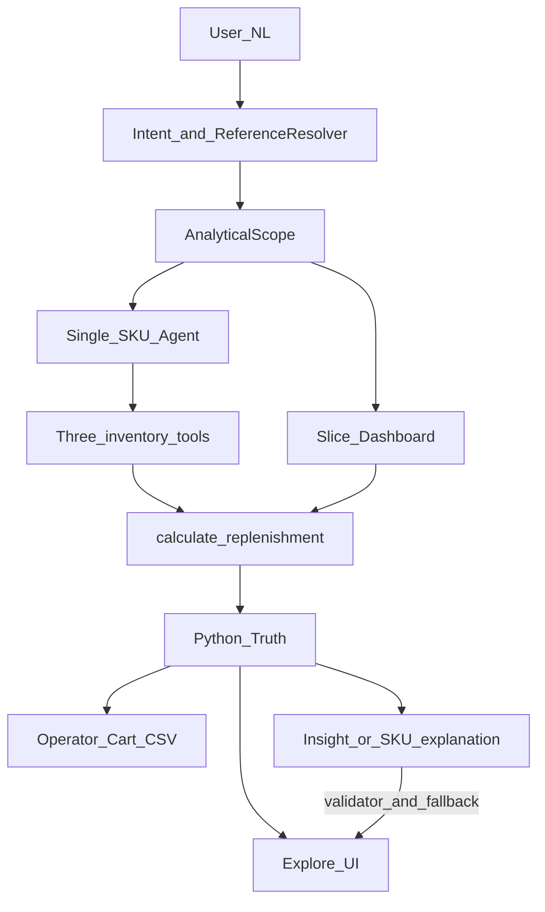

# SupplyMate

*English* · [Español](README.es.md)

AI Engineering MVP: conversational replenishment over a structured catalog — natural language as the interface, Python as the source of truth.

**Principle:** *LLM orchestrates, deterministic code decides.*

## Why it exists

A distribution operator needs a trustworthy answer to:

> How much of product X should I order to cover the next 7 days?

The hard failure mode is not “no answer” — it is **inconsistency** between interpretation, stock, demand, filters, and recommended quantity. SupplyMate keeps those concerns separate:

- the **LLM orchestrates** (intent, explanation, insight)
- **Python decides** (formula, filters, CSV)

## Who this is for

- **Applied AI engineers** studying tool-calling + deterministic logic + validated insights
- **Ops / supply** teams who need an exportable purchase order on the same slice they see
- **Engineers evaluating LLM + deterministic workflows** (not chat wrappers that invent numbers)
- **Interviews** — small, testable, easy-to-narrate MVP

## Why not just use X?

- **RAG / embeddings** — structured CSV and lexical SKU matching; no embedding models at runtime
- **Let the LLM calculate** — critical numbers are owned by Python; the model narrates validated facts
- **Forecasting / ML / EOQ** — out of scope; the replenishment policy is explicit and simple
- **Multi-agent swarm** — bounded LLM roles (intent / explain / insight / commit), not a swarm

Filtering and KPIs stay in Python on the active scope so the model does not own the panel. Extended alternatives (LangChain, Postgres/dbt, etc.): [`docs/operations/local-dev.md`](docs/operations/local-dev.md). Architecture: [`docs/contract/architecture.md`](docs/contract/architecture.md).

## How it works

Natural language enters intent and reference resolution, becomes an `AnalyticalScope`, then either the Explore slice or a single-SKU agent. Recommended quantity always comes from `calculate_replenishment()` in Python.

SupplyMate uses a reproducible **API-like data contract**: CSV resources in [`data/`](data/) simulate external operational APIs (products, prices, inventory, sales, replenishment params), joined by `product_id`. Details: [`docs/contract/data-contract.md`](docs/contract/data-contract.md).



*Simplified view. SKU explanation and insight/commit are distinct LLM roles with guardrails.*

| Artifact | Role |
|----------|------|
| API-like CSV resources (`data/`) | Simulate external ops APIs (products, inventory, prices, sales, replenishment params); ~13k SKUs; see [data-contract](docs/contract/data-contract.md) |
| `CatalogStore` | Loads those resources in-memory and resolves products |
| `AnalyticalScope` | Structured analytic state (filters, horizon) |
| `calculate_replenishment()` | Operational qty truth |
| LLM roles | Intent, explain, insight; optional commit narration |
| Validator + fallback | Rejects invalid insight; deterministic summary on failure |
| Vite UI | Chat + **Explore** / **Review PO** (consumes slice truth) |

### Core concepts

- **API-like data contract** — resource CSVs stand in for external ops APIs; agent tools read through `CatalogStore`, not raw files as fixtures only
- **AnalyticalScope** — structured analytic state shared by chat, panel, and export predicates
- **Deterministic replenishment** — order-up-to qty in Python (`ceil`, `max(0, …)`); formula details in [`local-dev`](docs/operations/local-dev.md)
- **LLM boundary** — the model interprets, explains, and summarizes; it does not control qty, filters, or CSV rows

## What the MVP proves

- `6033436` → recommended quantity **173**; `8141600` → **0** (reproducible calculation)
- Same predicates drive `GET /replenishment/slice` and purchase-list CSV export
- Qty is computed in Python; LLM narration is validated against those facts
- Invalid or failed insight → deterministic fallback (`insight_source=fallback`)
- Operator owns the PO: add lines, edit qty, pick CSV columns (default `barcode` + `order_quantity`)

Purchase value = qty × list price (not retail PVP). Panel truth: [`docs/operations/recorte-coherence.md`](docs/operations/recorte-coherence.md).

### Screenshots


## What the clone includes

| Out of the box | Optional |
|----------------|----------|
| API-like CSV resources in [`data/`](data/) (reproducible demo) | `GROQ_API_KEY` / DeepSeek / OpenAI-compatible |
| FastAPI + agent + formula | Live LLM calls |
| Vite frontend (`frontend/`) | Docker (API image) |
| pytest + goldens / evals (no live LLM in main CI) | |

## Quickstart

```bash
git clone https://github.com/javi2481/SupplyMate.git
cd SupplyMate
python -m venv .venv
# Windows: .venv\Scripts\activate
pip install -e ".[dev]"
cp .env.example .env
# Edit .env — GROQ_API_KEY (https://console.groq.com/keys) or another provider below

pytest -m "not performance and not llm"
uvicorn app.api:app --reload --host 127.0.0.1 --port 8000
```

In another terminal:

```bash
cd frontend
cp .env.example .env   # VITE_SUPPLYMATE_API_URL=http://127.0.0.1:8000
npm install
npm run dev -- --host 127.0.0.1 --port 8080
```

Open **http://127.0.0.1:8080**. If port `8000` is taken, run the API on `8001` and set `VITE_SUPPLYMATE_API_URL` accordingly.

Curls, smoke script, Docker: [`docs/operations/local-dev.md`](docs/operations/local-dev.md).

## Terminal flow

**Single SKU path**

```text
Question: How much should I order of 6033436?
   ↓
Intent / reference → 3 tools → calculate_replenishment
   ↓
Answer: qty 173 + How it was calculated (validated)
```

**Explore / PO path**

```text
Question: What products should I buy?
   ↓
Explore → scope / filters (0 LLM per click) → operator adds SKUs
   ↓
Review PO → Export CSV (column picker)
   ↓
If LLM insight fails → deterministic fallback
```

UI vocabulary: **Explore → Review PO → Export CSV**. Clicks, filters, and CSV = **0 LLM calls**.

## Scope

| Included | Excluded |
|----------|----------|
| 3 inventory tools + bounded LLM roles | RAG / embeddings required |
| Deterministic order-up-to calculation | Forecasting / ML / EOQ |
| API-like CSV resources (reproducible demo) | Postgres app DB / dbt / Airflow / Superset |
| Vite Explore / Review PO | Mandatory separate BI tool |
| Operator-driven cart + column-picker CSV | Multi-agent swarm / LangChain |
| Insight with validator + deterministic fallback | LLM owns qty or row filters |
| Goldens / evals in CI without live LLM | ERP write-back / auth (milestones) |

## Optional LLM providers

**Groq** (default) · **DeepSeek** · **OpenAI-compatible** — see [`.env.example`](.env.example). Recommended quantity does not depend on which model you choose.

## Documentation

| Doc | Contents |
|-----|----------|
| [`docs/contract/architecture.md`](docs/contract/architecture.md) | LLM vs Python boundary, tools, slice/scope |
| [`docs/contract/evaluation.md`](docs/contract/evaluation.md) | CI, goldens, pytest markers |
| [`docs/contract/data-contract.md`](docs/contract/data-contract.md) | API-like resource CSVs / `product_id` |
| [`docs/operations/recorte-coherence.md`](docs/operations/recorte-coherence.md) | Panel owner + coherence invariants |
| [`docs/operations/local-dev.md`](docs/operations/local-dev.md) | Formula, curls, Docker, extended Why not X |
| [`docs/README.md`](docs/README.md) | Full doc index |

## Status

**v0.5.0** — conversational replenishment + sliceable Explore panel; qty and filters in Python; operator-driven PO cart.

Portfolio / academic MVP; not an ERP or forecasting system.

## Next milestones

1. Second catalog source — validate the CSV contract on another dataset
2. Stronger query / reference evaluation — multiturn goldens and resolution
3. API auth — endpoints ready for controlled deployment
4. Richer PO formats — ERP templates beyond the column picker

## Contributing

Contributions welcome — see [CONTRIBUTING.md](CONTRIBUTING.md).

## Repository health

[](https://github.com/javi2481/SupplyMate/actions/workflows/ci.yml)

CI runs `pytest -m "not performance and not llm"`, coverage gates on critical modules, and Docker smoke. Marker `llm` is excluded from main CI.

## License

MIT — see [`LICENSE`](LICENSE).
