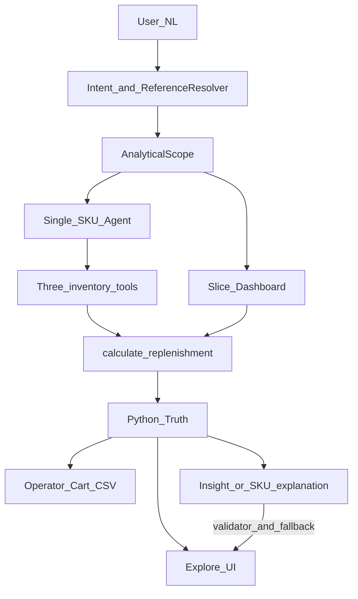

**Español** · [English](architecture.md) · [README](../README.md) · [README ES](../README.es.md)

# Arquitectura

Para el problema y el inicio rápido, ver el [README ES](../README.es.md). Este documento es el **contrato técnico**: frontera LLM, tools, slice/scope, superficies y layout del repo.

SupplyMate es un **asistente de reposición**, no un chat genérico. La entrada del usuario pasa por routing de intención; **Python calcula qty, filtros y CSV** antes de emitir narración del LLM.

*Términos técnicos en inglés a propósito: slice, scope, tools, qty, insight, commit.*

## Capas de fuente de verdad

| Artefacto | Rol |
|-----------|-----|
| Recursos CSV API-like en `data/` | APIs ops externas simuladas (ver [data-contract](data-contract.es.md)); unidos por `product_id` |
| `CatalogStore` (`app/catalog/store.py`) | Carga esos CSV por recurso in-memory y resuelve productos (no un dump monolítico) |
| `ProductMaster` | Fila unificada para métricas y reposición |
| `calculate_replenishment()` | Verdad operativa de qty |
| Roles LLM | Intent, explain, insight, narración commit opcional |
| Frontend Vite | UI consumidora viva (no fuente de verdad) |

Las tres tools del agente (`get_inventory`, `get_sales_history`, `get_replenishment_params`) consumen esos recursos vía `CatalogStore`. FastAPI (`/chat`, `/replenishment/*`, `/products/*`) es la API de **aplicación** — no sustituye el contrato de datos API-like.

*Vista simplificada. La explicación de SKU y el insight/commit son roles LLM distintos con guardrails. Mismo diagrama que el [README ES](../../README.es.md#cómo-funciona).*

## Frontera LLM vs Python

| Concern | Dueño |
|---------|-------|
| `recommended_quantity` | Python (`app/core/replenishment.py`) |
| Filtros slice, KPIs dashboard | Python (`app/services/analytics/catalog_service.py`, `dashboard.py`) |
| Filas CSV OC del scope actual | Python (mismos filtros que slice) |
| Clasificación de intención | Regex + clasificador; LLM para texto libre ambiguo |
| Prosa de explicación SKU | LLM, validada contra hechos Python |
| Insight Explorar / resumen OC opcional | LLM + `insight_validator`; fallback determinístico si falla |

**Python decide qty. El LLM explica y resume.**

## Superficie de tools

Tres tools del OpenAI Agents SDK en [`app/agent/tools.py`](../app/agent/tools.py):

| Tool | Devuelve |
|------|----------|
| `get_inventory` | `current_stock` |
| `get_sales_history` | unidades vendidas 30d (expansión diaria uniforme en store) |
| `get_replenishment_params` | `lead_time_days`, `safety_stock` |

Flujo agente para un SKU: tools llenan `SupplyContext` → `calculate_replenishment()` → explicación validada.

Constantes de política: `HORIZON_DAYS = 7`, `HISTORY_DAYS = 30`, nombre `order-up-to`. Ver [`app/core/replenishment.py`](../app/core/replenishment.py).

## Slice y scope

- **`GET /replenishment/slice`** — filas SKU y dashboard del `UiSlice` activo; **dueño único de KPIs / chart / tabla** en Explorar.
- **`AnalyticalScope`** — categoría, subcategoría, proveedor, salud, cobertura, name tokens, horizonte.
- **Chat board** — placeholder optimista solo mientras carga el slice; nunca verdad durable sobre un scope ya cambiado.
- **Clicks en el panel Explorar** — actualizan scope vía query params del slice; **0 llamadas LLM** por click de filtro.
- **Álgebra de filtros** (`filter_rows`): mismo eje → OR; ejes distintos → AND.
- **Carrito operator-driven** — Explorar sugiere; el operador agrega líneas, edita `order_quantity` en Revisar OC y elige columnas del CSV al exportar.

[`app/services/scoping/scope_sanitize.py`](../../app/services/scoping/scope_sanitize.py) sanitiza payloads de scope. [`app/pipeline/scope_builder.py`](../../app/pipeline/scope_builder.py) fusiona eventos UI en scope. Checklist: [`docs/operations/recorte-coherence.md`](../operations/recorte-coherence.md).

## Superficies

| Superficie | Puerto | Rol |
|------------|--------|-----|
| FastAPI | 8000 | Runtime: `/chat`, `/replenishment/*`, `/products/*` |
| Frontend Vite (`frontend/`) | 8080 | UI viva: chat + Explorar + Revisar OC |
| Imagen Docker | 8000 | Solo API (`COPY app`, `COPY data`) |

Endpoints clave:

- `POST /chat` — router de intención + agente
- `GET /replenishment/slice` — dashboard + tabla del scope activo
- `POST /replenishment/analyze` — insight explore o resumen commit
- `GET /replenishment/purchase-list.csv` — export OC server-side de un scope
- CSV del carrito en cliente — picker de columnas en Revisar OC (default barcode + qty)
## Layout del repo

Layout por capas — detalle en [`app/README.md`](../../app/README.md) y [`tests/README.md`](../../tests/README.md). Índice: [`docs/README.md`](../README.md).

| Path | Rol |
|------|-----|
| `app/api.py` | App FastAPI + middleware |
| `app/core/` | Modelos, config, fórmula replenishment |
| `app/catalog/` | Store CSV, resolución de productos |
| `app/pipeline/` | Interpretación → resolución → scope |
| `app/guidance/` | Chips, misiones, próxima pregunta guiada |
| `app/agent/` | Agentes LLM, tools, routing (`runner.py`) |
| `app/services/analytics/` | Slice, dashboard, métricas |
| `app/services/scoping/` | Mutaciones de scope, panel modes, filtros sugeridos |
| `app/services/insight/` | Prompt compiler, validator, cache de insight |
| `app/middleware/` | Rate limit, safe errors, security headers |
| `frontend/` | UI viva Vite (Explorar / Revisar OC) |
| `data/` | CSVs por recurso (ver [data-contract.es.md](data-contract.es.md)) |
| `tests/` | pytest por capas + goldens CSV |
| `docs/contract/` | Arquitectura, evaluación, contrato de datos |
| `docs/operations/` | Runbook local-dev, mantenimiento, seguridad, rendimiento |
| `openspec/` | SDD interno (specs strict TDD por change) |

Las specs internas viven en `openspec/changes/` — no son el índice público del README.
