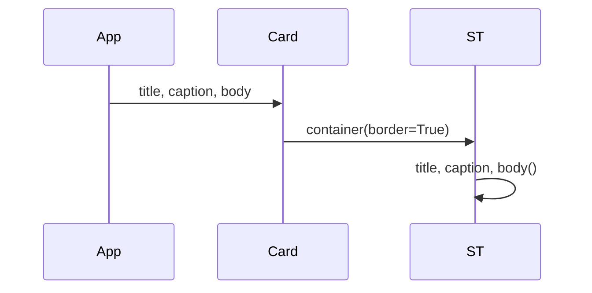

# Design: Streamlit Native Shell

## Technical Approach

Fix Streamlit composition, not CSS. Split markdown (`sm-chart-card`, `sm-panel`, `sm-composer`, `rail-row`) never parents later widgets. Nest charts/rail in `st.container(border=True)`. Recolor Explore charts and Coverage/Productos via `SHELL_TOKENS["primary_accent"]` without mutating `HEALTH_COLORS` / `COVERAGE_COLORS`. Keep `st.bottom` + `st.chat_input`. Compact mode header; identity in sidebar footer. Specs may land in parallel; do not restore ui-v2 Explore.

## Architecture Decisions

| # | Decision | Choice | Alternatives | Rationale |
|---|----------|--------|--------------|-----------|
| 1 | Card chrome | Native `st.container(border=True)` | Split HTML; CSS glue | Widgets never nest into split markdown; glue already failed |
| 2 | Width | `.block-container` max-width CSS | Extra HTML wrapper | Real Streamlit width hook; no second split-HTML bug |
| 3 | Explore charts | One Altair scale from `SHELL_TOKENS["primary_accent"]` | Mutate `COVERAGE_COLORS`; keep `orangered` | Dicts stay for `render_coverage_strip`; charts are brand, not health |
| 4 | KPI accents | Coverage + Productos → `SHELL_TOKENS["primary_accent"]`; Falta/Quiebre stay `HEALTH_COLORS` | Invert palettes | Health stays orange/red; brand blue on non-health Explore KPIs |
| 5 | Composer | Keep `st.bottom`; delete `sm-composer` HTML | Fake clip chrome | Input already works; decorative HTML is empty sibling |
| 6 | Avatars | Explicit `st.chat_message(..., avatar=)` | `:has([data-testid])` CSS | Public API; delete avatar-hack CSS after |
| 7 | Header / CTA | Compact mode in main; identity in sidebar; CTA not `--sm-danger-accent` | Giant `.sm-hero-title`; danger-red primary | Hero dominates chat; new-thread is not destructive |
| 8 | TDD | Rewrite anti-pattern AppTests first (RED then GREEN) | Implement, then patch tests | `strict_tdd: true`; current tests lock empty wrappers |
| 9 | Done gate | Real browser visual verify; pytest necessary not sufficient | pytest + HTTP 200 | AppTest cannot prove nesting (`ui-mockup-polish` false done) |
| 10 | Streamlit floor | `>=1.57.0` in `pyproject.toml` | Keep `>=1.38.0` | `st.bottom` public since 1.57 |
| 11 | `theme.py` | Delete leftover wrapper/composer/avatar-hack/danger/hero CSS; add `.block-container` | Wholesale rewrite | Tokens already correct |
| 12 | Unused Explore kwargs | Off the visual critical path | Clean `render_live_panel` now | Slim Explore already correct; cleanup is optional |

## Data Flow



Composer: `with st.bottom: st.chat_input(...)` only. History: `st.chat_message(role, avatar=…)`. Live panel: keep outer `st.container()`; drop `sm-panel`. Rail: `st.container(border=is_active)` per row.

## File Changes

| File | Action | Description |
|------|--------|-------------|
| `ui/components.py` | Modify | Native `render_chart_card`; keep single-blob KPI HTML |
| `ui/streamlit_app.py` | Modify | Drop `sm-panel`/`sm-composer`; keep `st.bottom`+`chat_input`; `avatar=` |
| `ui/threads/rail.py` | Modify | Native rows; CTA via `NEW_CHAT` |
| `ui/charts.py` | Modify | Brand-blue scale; leave color dicts |
| `ui/composition/kpi_policy.py` | Modify | Productos + Cobertura → `SHELL_TOKENS["primary_accent"]` |
| `ui/theme.py` | Modify | Delete leftover CSS; `.block-container` ~1100–1150px; brand primary/active-rail |
| `ui/chrome.py` | Modify | Compact mode header |
| `ui/composition/copy.py` | Modify | `NEW_CHAT = "+ Nuevo recorte"` |
| `pyproject.toml` | Modify | `streamlit>=1.57.0` |
| `tests/unit/ui/test_visual_shell_apptest.py` | Modify | Rewrite wrapper/composer/hero |
| `tests/unit/ui/test_composition_kpi_table.py` | Modify | Accent-color contract |
| `tests/unit/ui/test_charts_selection.py` | Modify | Single-blue scale; keep selection |
| `tests/unit/ui/test_thread_rail_apptest.py` | Modify | Copy + no split rail HTML |
| `tests/unit/ui/test_layout_apptest.py` | Keep | Slim Explore; touch only if kwargs cleaned |
| `ui/threads/store.py` | Keep | `DEFAULT_TITLE` stays `"Nuevo chat"` |
| `openspec/changes/streamlit-native-shell/specs/visual-shell/spec.md` | Spec (parallel) | MODIFY native cards, no fake composer, compact hero |
| `openspec/changes/streamlit-native-shell/specs/surfaces/spec.md` | Spec (parallel) | MODIFY header identity; do not restore Explore sequence |

## Interfaces / Contracts

```python
with st.container(border=True):
    st.markdown(title)  # or st.subheader
    if caption:
        st.caption(caption)
    body()
```

KPI HTML in a **single** `st.markdown` blob (`sm-kpi-row`) is valid nested HTML — do not “fix” KPI cards like split wrappers. Brand: `SHELL_TOKENS["primary_accent"]` / `#1E88E5`. Avatars: user = person, assistant = analytics.

## Testing Strategy

| Layer | File | What |
|-------|------|------|
| Unit | `tests/unit/ui/test_composition_kpi_table.py` | Productos + Cobertura == `SHELL_TOKENS["primary_accent"]`; Falta/Quiebre == `HEALTH_COLORS` |
| Unit | `tests/unit/ui/test_charts_selection.py` | Scale not `orangered`; histogram range not `COVERAGE_COLORS`; keep selection |
| AppTest | `tests/unit/ui/test_visual_shell_apptest.py` | RED first: no `sm-chart-card`/`sm-composer`/`sm-hero-title`; title + `chat_input`; compact mode header |
| AppTest | `tests/unit/ui/test_thread_rail_apptest.py` | Visible `+ Nuevo recorte`; no split `rail-row` HTML |
| AppTest | `tests/unit/ui/test_layout_apptest.py` | Slim Explore (scope + 4 KPIs + 2 charts); no next-step/table/analyst |
| Visual | Real browser (hard verify gate) | Nested cards; brand charts/KPIs; compact header; brand CTA; `st.chat_input` in `st.bottom` |

TDD: rewrite wrapper-class AppTests **before** implementation.

## Threat Matrix

N/A — no routing/shell/process boundary.

## Migration / Rollout

No migration. Revert the branch. `DEFAULT_TITLE` stays `"Nuevo chat"`. Bump Streamlit to `>=1.57.0`.

## Open Questions

None that block. Visual max-width ~1100–1150px is a verify tweak.
