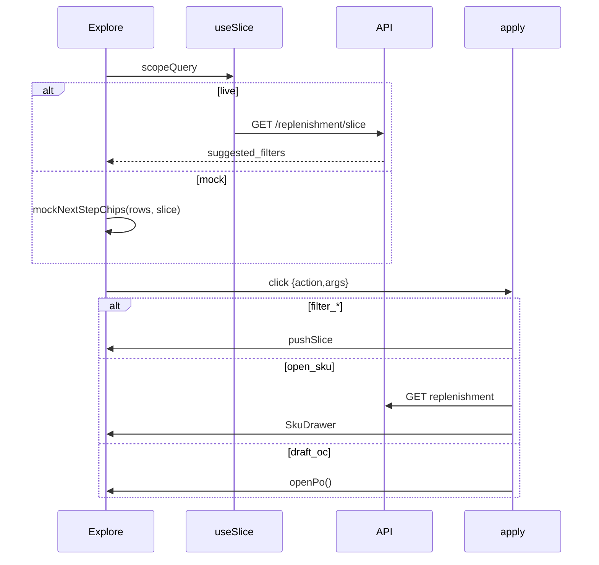

# Design: Explore next-step chips

## Technical Approach

Python stays source of truth: `suggest_next_filters` already rides on `GET /replenishment/slice` as `suggested_filters`. Explore renders that payload (or a same-order mock ranker). Clicks apply `filter_*` / `open_sku` / `draft_oc` — never `send(label)`.

## Architecture Decisions

| Decision | Options | Tradeoff | Choice |
|----------|---------|----------|--------|
| Chip location | Chat `DEFAULT_CHIPS` vs Explore 3×2 | Chat chips look like prompts | **Explore 3×2** after recorte bar; drop chat chip row; form unchanged |
| `filter_supplier` | Skip v1 vs `suppliers: string[]` | Skip drops 4th-ranked chip; `ScopeQuery.supplier` exists | **Add `suppliers`** on `UiSlice` + Index `Slice`; query sends `supplier` |
| Apply vs toggle | Union vs replace vs toggle | Chart replaces `cats`; Streamlit unions; KPI toggles | **Union** cats/suppliers/health; **set** coverage. Python skips active |
| `open_sku` off page | Raise `limit` vs lookup+GET | Keep table 50 | Find in `rows`, else `purchaseList`/`ROWS`, then existing `openDetail` GET |
| Mock chips | Hit slice API vs rank mock rows | No second qty formula | **`nextStepChips.ts`** same order on `Calc[]` / existing mock qty |
| Streamlit `draft_oc` | No-op vs one-line apply | New action can appear in secondary | **`apply_filter_action` → `_enter_commit_mode()`**. Labels change (OK). Secondary still capped at 3 — leave it |

## Data Flow

Live: `useSlice` MUST return `suggestedFilters` from `fetchSlice` (typed, currently dropped). Mock ignores API chips. Hide strip if empty; never pad.

## File Changes

| File | Action | Description |
|------|--------|-------------|
| `app/services/scoping/suggested_filters.py` | Modify | Cap 3→6; 2nd category; overstock; `ACTION_DRAFT_OC`; short labels |
| `tests/unit/dashboard/test_suggested_filters.py` | Modify | Cap 6, extras, skip-active, short labels |
| `ui/streamlit_app.py` | Modify | `draft_oc` branch in `apply_filter_action` only |
| `frontend/src/hooks/use-slice.ts` | Modify | Return `suggestedFilters` |
| `frontend/src/lib/api.ts` | Modify | Export `SuggestedFilter` type alias |
| `frontend/src/lib/scope.ts` | Modify | `suppliers: string[]` on `UiSlice`; query + payload round-trip |
| `frontend/src/lib/scope.test.ts` | Modify | Supplier serialization |
| `frontend/src/lib/nextStepChips.ts` | Create | Mock ranker (same order) |
| `frontend/src/lib/nextStepChips.test.ts` | Create | Ranking / skip-active / cap / no pad |
| `frontend/src/lib/applySuggestedFilter.ts` | Create | Pure action → command |
| `frontend/src/lib/applySuggestedFilter.test.ts` | Create | Mapping table below |
| `frontend/src/routes/index.tsx` | Modify | Drop `DEFAULT_CHIPS`; Explore 3×2; local `Slice.suppliers`; wire apply. Do not split. |

No deletes. Do not migrate Index onto unused `useScope`.

## Interfaces / Contracts

Payload unchanged: `{ action, args, label }`.

Ranking (first applicable, cap 6): unused `by_category[0]` → coverage (`0–3 días` else next `sku_count>0`) → `stockout_risk` → top supplier → `open_sku` (items[0]) → unused `by_category[1]` → `overstock` if `snap.overstock>0` → `draft_oc` if items.

Labels (Streamlit text changes too):

| action | args | label |
|--------|------|-------|
| `filter_category` | `{category}` | `¿Qué hay en {category}?` |
| `filter_coverage` | `{coverage_bucket}` | `¿Cobertura {bucket}?` |
| `filter_health` | `stockout_risk` | `¿Riesgo de quiebre?` |
| `filter_health` | `overstock` | `¿Hay sobrestock?` |
| `filter_supplier` | `{supplier}` | `¿Qué pide {supplier}?` |
| `open_sku` | `{product_id}` | `¿Cuánto pedir de {name[:32]}?` |
| `draft_oc` | `{}` | `¿Armar la OC?` |

Apply mapping (`applySuggestedFilter.ts`):

| action | React |
|--------|--------|
| `filter_category` | `cats` union |
| `filter_coverage` | `coverage = band` |
| `filter_health` | `stockout_risk`→`riesgo_quiebre`; `overstock`→`sobrestock` |
| `filter_supplier` | `suppliers` union |
| `open_sku` | drawer via GET replenishment |
| `draft_oc` | `openPo()` |
| unknown | no-op (no chat) |

## Testing Strategy

Strict TDD. No LLM.

| Layer | What | Approach |
|-------|------|----------|
| Unit (pytest) | Cap 6, skip active, 2nd category, overstock, `draft_oc`, short labels, ranking order | Extend `test_suggested_filters.py` |
| Unit (vitest) | Mock ranker vs fixture `Calc[]`; apply mapping; `sliceToScopeQuery` supplier | New `*.test.ts` + `scope.test.ts` |
| Integration | Slice still returns `suggested_filters` | Existing API tests; no new e2e |
| E2E | — | None |

## Threat Matrix

N/A — no routing/shell/subprocess/VCS/process-integration boundary. Existing `/` and `fetchSlice` only.

## Migration / Rollout

No migration. Revert the branch to restore `DEFAULT_CHIPS` + cap 3.

## Open Questions

None. Streamlit `compose_next_step` still shows ≤3 suggested filters (out of scope).
